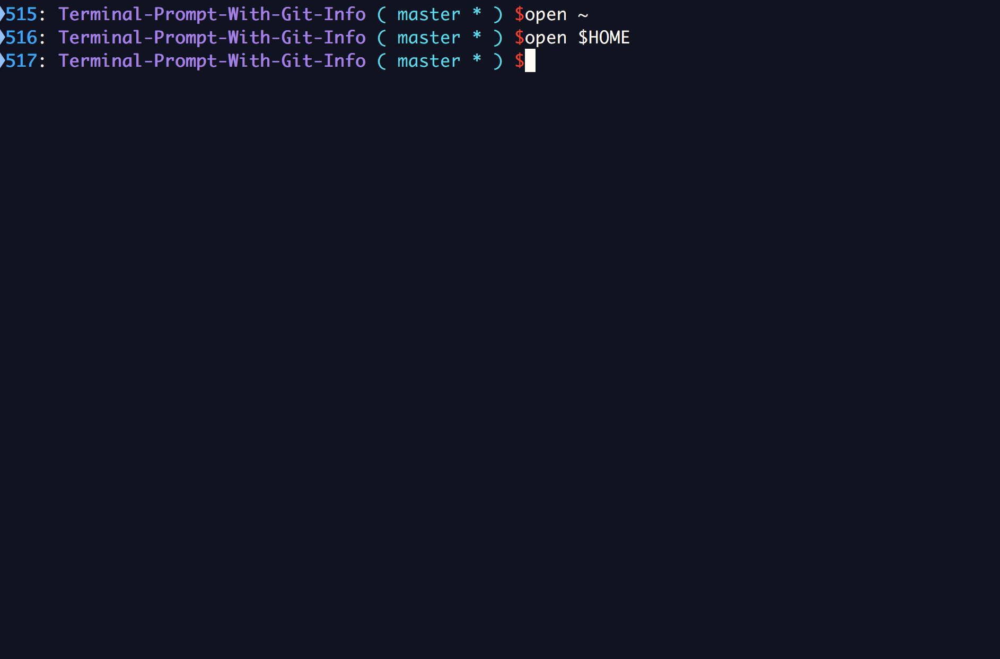

## ABOUT
If the current folder is a git repository, adds the following to the prompt (if applicable): 

- git branch name
- git status (* for uncommited changes)
- ahead or behind status from the remote

## INSTRUCTIONS
Simply add the code available in the `.profile` and `.bash_profile` to the same files in your `$HOME` directory (They may be hidden, so you can use the terminal to edit them `vi ~/.bash_profile` or `vi $HOME/.profile` e.g. You can also open them up in your favorite editors)